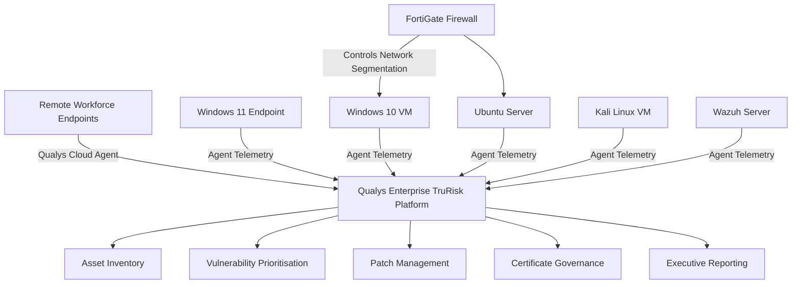

# Enterprise Qualys VMDR & Cyber Risk Governance Lab

## Recruiter Summary

This repository demonstrates my ability to operate at the intersection of **infrastructure engineering, security operations and Governance, Risk & Compliance (GRC)**. The project shows how Qualys VMDR and CyberSecurity Asset Management can be used to discover assets, assess vulnerabilities, prioritise cyber risk, manage patch remediation, monitor certificate exposure and produce executive-level reporting in an enterprise environment.

The work is based on a practical CloudNova Tech scenario covering Windows and Linux assets, a virtualised lab environment, Qualys Cloud Agents, FortiGate-segmented connectivity, vulnerability dashboards, asset inventory, software lifecycle visibility, patch deployment evidence and management reporting.

---

## Project Title

**Enterprise Qualys VMDR & Cyber Risk Governance Lab**

## Project Scenario

CloudNova Tech is a fast-growing technology organisation with a hybrid estate made up of remote users, Windows endpoints, Linux servers, virtualised infrastructure and security tooling. The organisation required better visibility of its asset estate, improved vulnerability prioritisation, stronger patch governance and better evidence for audit and executive decision-making.

This project was designed and documented from the viewpoint of an **enterprise GRC manager working closely with infrastructure and security engineering teams**.

---

## Business Drivers

- Improve cybersecurity asset visibility across Windows and Linux systems
- Identify unmanaged, under-managed or high-risk assets
- Detect vulnerabilities across endpoint and server environments
- Prioritise remediation using severity, exposure and asset criticality
- Improve patch deployment governance and remediation evidence
- Identify software lifecycle and end-of-life risk
- Support certificate lifecycle governance
- Produce executive dashboards and audit-ready evidence

---

## Framework Alignment

This project aligns with recognised cybersecurity governance and risk-management practices:

- **NIST Cybersecurity Framework 2.0**: Govern, Identify, Protect, Detect, Respond and Recover
- **NIST SP 800-40 Rev. 4**: Enterprise patch management planning and preventive maintenance
- **Risk-based Vulnerability Management**: Prioritisation based on exposure, severity, exploitability and business context
- **Asset Governance**: Asset ownership, lifecycle tracking, software inventory and technology debt management

---

## Qualys Capabilities Demonstrated

| Capability | GRC Value | Evidence Produced |
|---|---|---|
| CyberSecurity Asset Management | Establishes enterprise asset visibility and risk context | Asset inventory, system details, software visibility, open-port exposure |
| Vulnerability Management / VMDR | Identifies and prioritises security weaknesses | Vulnerability dashboards, scheduled scans, risk views |
| Patch Management | Supports measurable remediation | Patch jobs, missing patches, installed patches, reboot evidence |
| Certificate Management | Supports certificate lifecycle governance | Certificate risk monitoring process and expiry governance model |
| Software Lifecycle Tracking | Highlights technology debt and EOL/EOS exposure | Software lifecycle, stale software and technology debt reporting |
| Executive Reporting | Supports audit and management oversight | CSV/PDF reporting templates and executive dashboard structure |

---

## High-Level Architecture



The architecture uses Qualys Cloud Agents to provide continuous endpoint visibility without relying only on internal network scans. This approach is suitable for hybrid and remote environments because assets can report securely to the Qualys cloud platform from different locations.

---

## Repository Structure

```text
enterprise-qualys-vmdr-grc-lab/
├── README.md
├── executive-summary.md
├── architecture/
├── asset-management/
├── vulnerability-management/
├── patch-management/
├── certificate-management/
├── governance/
├── reports/
├── screenshots/
└── templates/
```

---

## Key Outcomes

The project demonstrates practical capability in:

- Qualys account onboarding and platform familiarisation
- Qualys Cloud Agent deployment
- Windows and Linux asset onboarding
- Asset inventory and asset summary review
- Open-port exposure analysis
- Installed software and software lifecycle review
- Vulnerability dashboard review and customisation
- Scheduled vulnerability scanning
- Patch deployment job creation
- Missing patch review
- Installed patch validation
- Reboot requirement tracking
- Executive-style reporting
- Risk register and exception governance

---

## GRC View of the Project

From a GRC perspective, this project demonstrates that vulnerability management is not just scanning. It requires governance around:

- Asset ownership
- Risk prioritisation
- Remediation accountability
- Patch compliance
- Exception handling
- Residual risk acceptance
- Evidence retention
- Executive reporting

---

## What Recruiters Should Notice

This project shows hands-on and governance capability across:

- Enterprise vulnerability management
- Qualys VMDR and CSAM concepts
- Infrastructure security operations
- Patch management governance
- Risk-based remediation
- Audit evidence preparation
- Security dashboards and reporting
- Windows and Linux endpoint security
- Hybrid infrastructure visibility
- GRC-aligned cyber risk communication

---

## Suitable Role Alignment

This project is relevant to roles such as:

- Vulnerability Management Analyst
- Cyber Security Analyst
- GRC Analyst
- Security Operations Analyst
- Infrastructure Security Engineer
- Cloud Security Analyst
- Cyber Risk Analyst
- Security Engineer
- Patch Management Analyst
- Security Compliance Analyst

---

## Security Notice

Before publishing screenshots or reports to GitHub, all sensitive information must be redacted. This includes names, home addresses, emails, public IP addresses, activation keys, hostnames, serial numbers, account IDs, subscription details and any visible personal or customer information.

---

## References

- Qualys VMDR documentation: https://docs.qualys.com/en/vm/latest/
- Qualys CyberSecurity Asset Management documentation: https://docs.qualys.com/en/csam/latest/get_started/get_started.htm
- NIST Cybersecurity Framework 2.0: https://www.nist.gov/cyberframework
- NIST SP 800-40 Rev. 4, Guide to Enterprise Patch Management Planning: https://csrc.nist.gov/pubs/sp/800/40/r4/final
