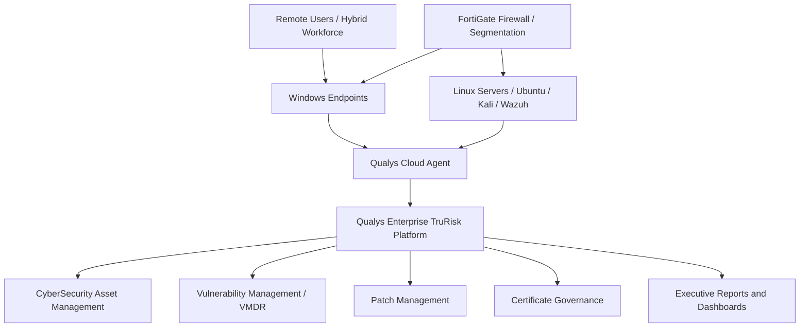

# High-Level Architecture

## Architecture Objective

The purpose of this architecture is to provide continuous visibility of endpoint and server assets through Qualys Cloud Agents. The agents report into the Qualys Enterprise TruRisk Platform, where data can be used for asset inventory, vulnerability prioritisation, patch management, certificate governance and executive reporting.

## Architecture Diagram

## Why Cloud Agents Were Used

Cloud agents are suitable for hybrid environments because they provide visibility even when users and devices are outside the corporate network. This reduces dependency on VPN-only visibility and allows assets to report directly to the Qualys platform.

## Enterprise Benefits

- Continuous asset visibility
- Reduced dependency on internal-only scanning
- Support for remote and hybrid workforce devices
- Better telemetry for risk-based vulnerability management
- Easier reporting across distributed systems
- Better support for patch and certificate governance
